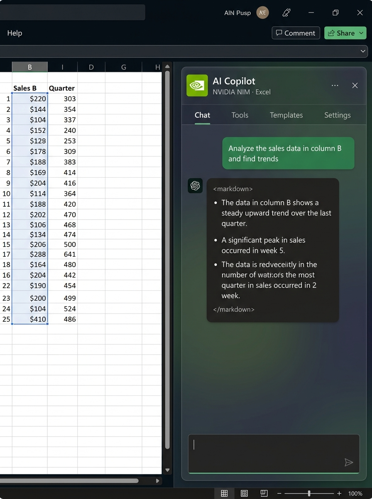

<p align="center">
  
</p>

<h1 align="center">Your-Office-CoPilot (Office Add-in)</h1>

<p align="center">
  <strong>Your custom AI-powered Office Add-in for Excel, Word & PowerPoint — powered by 7 AI providers</strong>
</p>

<p align="center">
  <a href="#-quick-start"></a>
  <a href="https://opensource.org/licenses/MIT"></a>
  
  
  
</p>

<p align="center">
  
</p>

---

## 🌟 What is this?

**Your Co-Pilot** is a free, open-source alternative to Microsoft Copilot that runs as a custom **Office Add-in** natively inside Excel, Word, and PowerPoint. It connects to **7 AI providers** (including free ones) and gives you AI superpowers for spreadsheets, documents, and presentations.

> **🔒 Privacy First:** Your API keys are stored locally in your browser. Your data is sent _only_ to the AI provider you choose — never to any third-party server.

### Why use this instead of Microsoft Copilot?

| Feature | Microsoft Copilot | Your Co-Pilot |
|---------|:-----------------:|:-----------------:|
| Price | $30/month | **Free** |
| AI Provider | GPT-4 only | **7 providers** (you choose) |
| Works offline | ❌ | ✅ (via Ollama) |
| Open source | ❌ | ✅ MIT License |
| Excel formulas | ✅ | ✅ |
| Data analysis | ✅ | ✅ |
| Chart suggestions | Limited | ✅ Full control |
| VBA/macro generation | ❌ | ✅ |
| Financial tools | ❌ | ✅ Built-in |
| Custom prompts | ❌ | ✅ 50+ templates |
| Office 2016/2019/2021 | ❌ 365 only | ✅ All versions |

---

## ✨ Features

### ⚡ Automated Copilot Actions (NEW)
The AI doesn't just give you text—it **directly manipulates** your documents in the background using invisible commands!
- **Excel:** Automatically write formulas, format cells, create charts, insert pivot tables, remove duplicates, apply filters, and group data.
- **Word:** Automatically insert formatted tables, inject paragraphs, apply styles (e.g., 'Heading 1'), clear messy formatting, and perform mass search-and-replace.
- **PowerPoint:** Automatically add blank slides, inject custom text boxes, generate geometric shapes, and format colors.

### 🤖 AI Chat
- Chat with your workbook, document, or presentation
- Streaming responses (text appears word-by-word)
- Conversation history with export
- Context-aware — AI sees your selected cells/text

### 📊 Excel Specific Tools
- **Data & Visualization:** Statistical summaries, trend analysis, auto-create charts, sparklines, conditional formatting.
- **Formulas & Code:** Generate/explain complex formulas, generate VBA macros and Power Query scripts.
- **Finance & Cleaning:** Financial ratios, depreciation, deduplication, missing values, formatting.

### 📝 Word Specific Tools
- **Rewrite & Summarize:** Adjust tone/style, extract executive summaries.
- **Grammar & Expansion:** Deep proofreading, adjust content length intelligently.

### 🎯 PowerPoint Specific Tools
- **Content Generation:** Auto-generate speaker notes, create slide outlines, prepare for Q&A.

---

## 🔌 Supported AI Providers

Switch between providers instantly from the settings panel:

| Provider | Free Tier | Best For | Get API Key |
|----------|:---------:|----------|-------------|
| **NVIDIA NIM** | ✅ Generous credits | Llama 3.1, Mixtral, Nemotron | [build.nvidia.com](https://build.nvidia.com/) |
| **Google Gemini** | ✅ 15 req/min | Large spreadsheets (1M context) | [aistudio.google.com](https://aistudio.google.com/) |
| **Groq** | ✅ Very fast | Instant responses, Llama 3.1 | [console.groq.com](https://console.groq.com/) |
| **OpenRouter** | ✅ Free models | Hundreds of models in one key | [openrouter.ai](https://openrouter.ai/) |
| **OpenAI** | 💰 Paid | GPT-4o, best reasoning | [platform.openai.com](https://platform.openai.com/) |
| **Anthropic** | 💰 Paid | Claude, best for writing | [console.anthropic.com](https://console.anthropic.com/) |
| **Ollama** | ✅ 100% Free | Offline, private, no internet | [ollama.com](https://ollama.com/) |

> **💡 Tip:** You can use this entire project for **$0** using NVIDIA NIM, Gemini, Groq, or Ollama.

---

## 🚀 Quick Start

### Option A: Deploy to Vercel (Recommended — Free)

This is the easiest way. Vercel gives you a free `https://` URL that Office requires.

```bash
# 1. Fork/clone this repo
git clone https://github.com/YOUR_USERNAME/office-ai-copilot.git
cd office-ai-copilot

# 2. Push to your GitHub
git remote set-url origin https://github.com/YOUR_USERNAME/office-ai-copilot.git
git push -u origin main
```

Then:
1. Go to [vercel.com](https://vercel.com) → **Add New Project** → select your repo → **Deploy**
2. Copy your Vercel URL (e.g. `https://office-ai-copilot.vercel.app`)
3. Update the URLs in `manifests/*.xml` (replace `https://localhost:3000` with your Vercel URL)
4. In Excel/Word/PowerPoint: **Insert → Add-ins → Upload My Add-in** → upload the XML

### Option B: Run Locally (Development)

```bash
# 1. Clone the repo
git clone https://github.com/YOUR_USERNAME/office-ai-copilot.git
cd office-ai-copilot

# 2. Install dependencies
npm install

# 3. Start dev server (HTTPS on port 3000)
npm start

# 4. Sideload in Excel
# Insert → Add-ins → Upload My Add-in → manifests/excel.xml
```

### Option C: Sideload on Desktop Office 2021/2019/2016

For desktop Office versions (not 365), use **Shared Folder Sideloading**:

1. **Create a shared folder** (e.g. `C:\MyAddins`)
2. Copy `manifests/excel.xml` (or word/powerpoint) into it
3. Update URLs inside the XML to your Vercel/hosted URL
4. Share the folder: Right-click → Properties → Sharing → Share
5. In Excel: **File → Options → Trust Center → Trust Center Settings → Trusted Add-in Catalogs**
6. Add the network path (e.g. `\\Your-PC\MyAddins`), check "Show in Menu"
7. Restart Excel → **Insert → My Add-ins → Shared Folder** → Add

---

## 🏗️ Architecture

```
office-ai-copilot/
├── manifests/                    # Office add-in manifests (XML)
│   ├── excel.xml
│   ├── word.xml
│   └── powerpoint.xml
├── assets/                       # Icons and images
├── src/
│   ├── commands/                 # Office ribbon commands
│   └── taskpane/                 # Main add-in UI
│       ├── components/
│       │   ├── chat/             # ChatPanel, MessageBubble, ChatInput
│       │   ├── excel/            # ExcelPanel + 6 tool categories
│       │   ├── word/             # WordPanel, WritingTools
│       │   ├── powerpoint/       # PowerPointPanel, SlideTools
│       │   ├── settings/         # SettingsPanel, ApiKeyManager, ModelSelector
│       │   ├── layout/           # Header, NavigationTabs, Sidebar
│       │   └── shared/           # MarkdownRenderer, CodeBlock, CopyButton
│       ├── hooks/                # useAI, useChat, useTheme, useSettings, useExcelTools
│       ├── services/
│       │   ├── ai/               # 7 AI provider implementations + factory
│       │   └── office/           # ExcelService, WordService, PowerPointService
│       ├── store/                # React Context (AppContext)
│       ├── styles/               # Global CSS + Fluent UI theme
│       ├── types/                # TypeScript type definitions
│       └── utils/                # Storage, formatters, prompt templates
├── package.json
├── tsconfig.json
├── webpack.config.js
└── README.md
```

### Tech Stack

| Layer | Technology |
|-------|-----------|
| **UI Framework** | React 18 + TypeScript 5.5 |
| **Design System** | Fluent UI v9 (Microsoft's official) |
| **Office Integration** | Office.js Add-in Framework |
| **Bundler** | Webpack 5 |
| **Markdown** | react-markdown + remark-gfm |
| **Code Highlighting** | react-syntax-highlighter (Prism) |

---

## ⚙️ Configuration

### API Keys

All API keys are managed through the **Settings** panel inside the add-in:

1. Click the ⚙️ gear icon in the sidebar header
2. Expand **🔑 API Keys**
3. Enter your key for any provider
4. Click **Save** — the key is tested automatically
5. Switch providers anytime from the **🤖 AI Configuration** dropdown

### Office Version Compatibility

The add-in uses feature detection to adapt to your Office version:

| Office Version | Excel API | Support Level |
|---------------|-----------|---------------|
| Office 2016 | 1.1–1.3 | ✅ Core features |
| Office 2019 | 1.1–1.9 | ✅ Most features |
| Office 2021 | 1.1–1.14 | ✅ Full features |
| Microsoft 365 | Latest | ✅ All features |
| Office Online | Latest | ✅ All features |

---

## 🛠️ Development

```bash
# Type checking
npm run typecheck

# Build for production
npm run build

# Validate manifests
npm run validate:excel
npm run validate:word
npm run validate:powerpoint
```

### Adding a New AI Provider

1. Create `src/taskpane/services/ai/YourProvider.ts` extending `BaseAIProvider`
2. Implement `chat()` and `chatStream()` methods
3. Register in `ProviderFactory.ts`
4. Add the provider type to `AIProviderType` in `types/index.ts`

---

## 🔐 Security

- **API keys** are stored in `localStorage` per-provider, never in source code
- **No telemetry** — zero tracking, zero analytics
- **No backend server** — the add-in runs entirely in the browser
- **Data flow**: Your data → directly to your chosen AI provider. Nothing else.
- **Ollama option** — for maximum privacy, run models 100% offline on your machine

---

## 🗺️ Roadmap

- [x] **Phase 1 (MVP)** — Chat, Excel/Word/PowerPoint tools, 7 AI providers
- [ ] **Phase 2** — Smart AI Agent (performs multi-step tasks like "build a dashboard")
- [ ] **Phase 3** — Custom function integration (`=AI.ANALYZE(A1:D50)`)
- [ ] **Phase 4** — Team features (shared prompts, org-wide deployment)

---

## 🤝 Contributing

Contributions are welcome! Here's how:

1. **Fork** the repository
2. **Create** a feature branch (`git checkout -b feature/amazing-feature`)
3. **Commit** your changes (`git commit -m 'Add amazing feature'`)
4. **Push** to the branch (`git push origin feature/amazing-feature`)
5. **Open** a Pull Request

### Development Setup

```bash
git clone https://github.com/YOUR_USERNAME/office-ai-copilot.git
cd office-ai-copilot
npm install
npm start
```

---

## 📄 License

This project is licensed under the MIT License — see the [LICENSE](LICENSE) file for details.

---

<p align="center">
  <strong>⭐ Star this repo if you find it useful!</strong>
</p>

<p align="center">
  Built with ❤️ using React, Fluent UI, and Office.js
</p>
